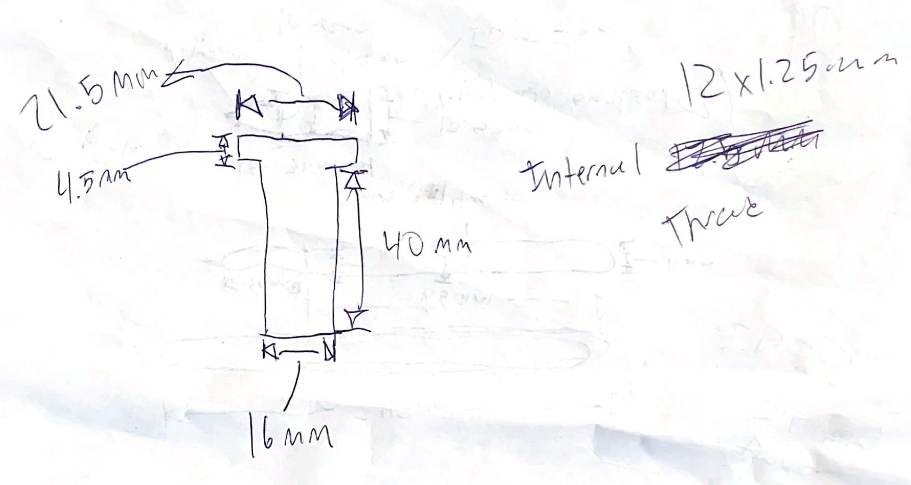
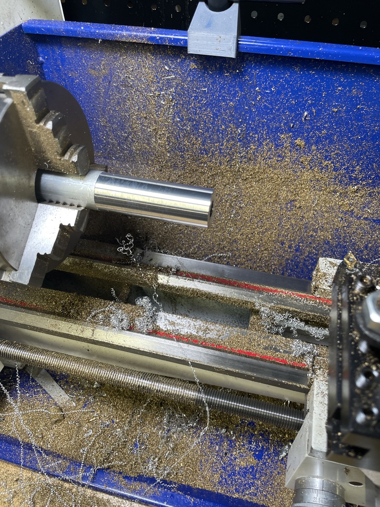
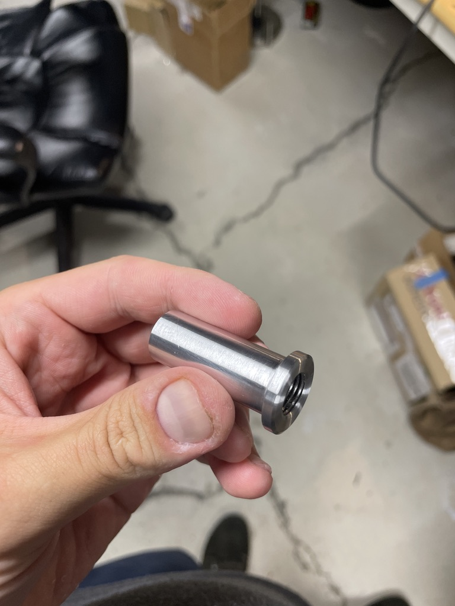
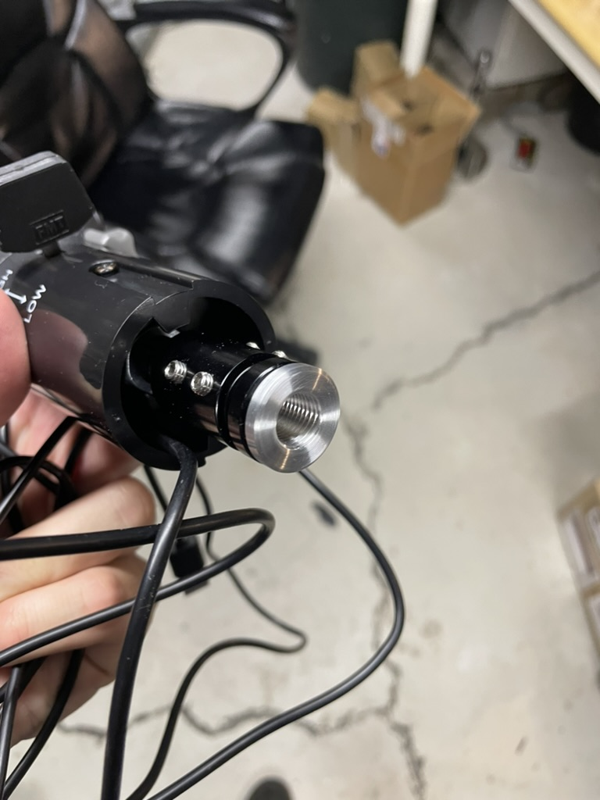
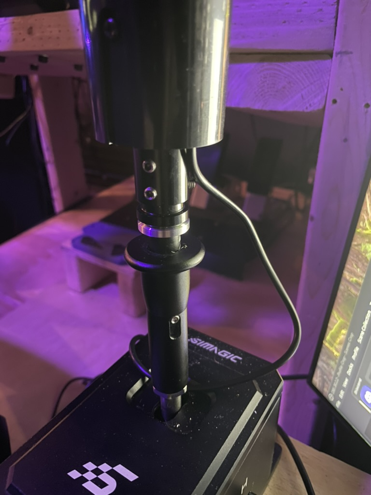

# Truck Sim Shifter Knob Upgrades: Part 1: Custom Thread Adapter

During the Steam Summer Sale, I grabbed _[American Truck Simulator](https://store.steampowered.com/app/270880/American_Truck_Simulator/)_ for _$2_, and I've finally gotten around to playing it. It’s been way more fun than I expected. After putting _several_ hours into the game, I decided I wanted a truck shifter knob and bought the [SimWayTech Truck Sim Shifter Knob](https://amzn.to/3YOHQGH).

I mounted it and started playing. It was great for a while, but eventually, it began to wobble a bit due to the mounting mechanism. It uses a rubber cylinder that wraps around the threads of the shifter’s shaft, with grub screws securing the knob to the rubber-covered shaft. It kind of works but becomes loose over time, and this mechanism makes it a hassle to switch between different shifter knobs.

## The Solution

I figured I could make a custom thread adapter on my lathe to solve this, so I took some quick measurements and drew out a very precise and technical sketch of what I wanted to make.

### Turning The Thread Adapter

Grabbed some aluminum bar stock and threw it in the lathe chuck. Then I used center drills to gradually open the bore up and finally used the appropriate drill for an M12 hole.

Next I had to turn it down to remove a bunch of material, as we started off with a 1" round stock. Finally, I drew the rest of the owl… turning down the remaining features and of course chamfering the edges.

### The Final Part

#### Test Fitment

It fits!

### End Result

So after a few hours, I've got it mounted back up to my shifter and it's working fantastic. Very stable.
