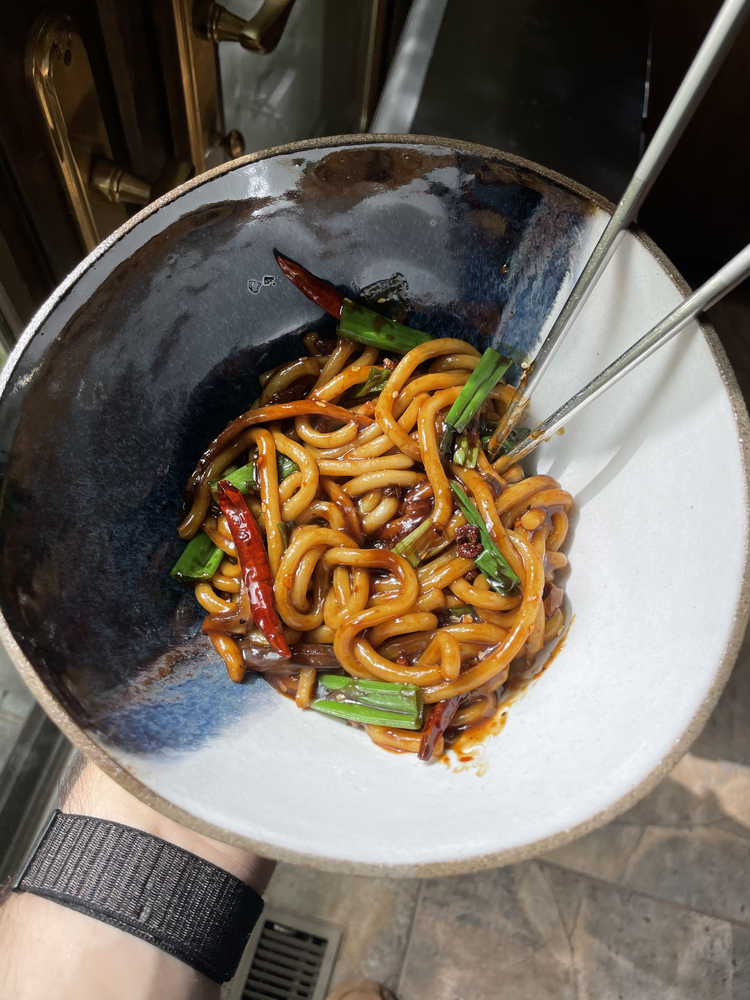

# Spicy Mala Noodles

## Ingredients
* 1 pack [noodles](https://www.amazon.com/gp/product/B08TQPX37T)
* 4 pieces of [dried shiitake mushroom](https://www.amazon.com/dp/B00PXRL3D8), sliced into small slivers
* 1 scallion, white cut into 1/2" pieces, green cut into 1" pieces
* 1 tbsp neutral oil (I use avocado)
* 1/2 tbsp sesame oil
* 1/2 tsp toasted sesame seeds
* 1 tsp [shaoxing wine](https://www.amazon.com/gp/product/B07PW1S84L)
### Sauce
* 1 tsp sugar
* 1 tsp msg
* 1 tsp starch
* 1/2 tsp [chinese red chili flakes](https://www.amazon.com/gp/product/B073FRT39D)
* 1 tsp [light soy sauce](https://www.amazon.com/gp/product/B07PGWZCT6)
* 1 tsp [dark soy sauce](https://www.amazon.com/gp/product/B01I4CVE8C)
* 1 tsp sesame oil
* 1 tsp oyster sauce 
* 1/2 tsp minced ginger from a bottle
* 1/2 tsp [shaoxing wine](https://www.amazon.com/gp/product/B07PW1S84L)
### Spice mix
* 1/2 - 1 tsp [szechuan peppercorn](https://www.amazon.com/gp/product/B071CX48ZS)
* 1/4 tsp [chinese red chili flakes](https://www.amazon.com/gp/product/B073FRT39D)
* 4-6 [chile de arbol peppers](https://www.amazon.com/gp/product/B07TYNF3ND), 1 cracked open
## Instructions
1. In a small pot, start boiling enough water to fully cover the noodles.
2. While the water is heating up, prepare the spices, mix the sauce, and cut the scallion and died shiitake mushrooms.
3. Add noodles and dried shiitake mushroom to boiling water.
4. In a pan, heat neutral oil and sesame oil. Add spice mixture and scallion whites. Cook until spices are slightly toasted and scallions are slightly browned. 
5. Reduce heat to low, and add sauce to the pan. Add some water from the noodle pot as necessary to loosen the sauce.
6. Use a spider to transfer noodles and shiitake mushrooms from the pot into the pan. Add scallion greens and sesame seeds. Toss to combine. Let sauce slightly reduce, tossing frequently.
7. Bring pan to high heat and add a splash of shaoxing wine to side of pan. Toss, and allow the shaoxing wine to cook off slightly.
